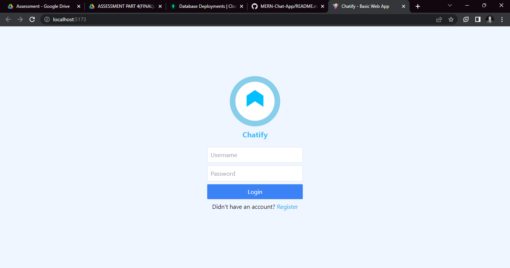
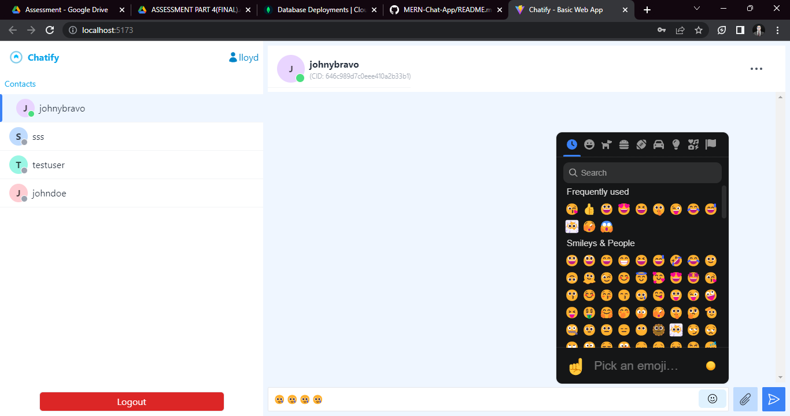

# MERN Stack Web Chat App


This is a MERN (MongoDB, Express.js, React.js, Node.js) stack web chat application. It provides features such as login and registration, contacts, chat history, file upload, avatars, emojis, and more. Please follow the instructions below to set up and run the application.

## Installation

Install yarn if you don't have it yet.

```
npm install --global yarn
```

Run `yarn install` to install the required dependencies.

### Server Setup

1. Navigate to the `server` folder.
2. Start the server by running `nodemon index.js` or `nodemon`.

### Client Setup

1. Navigate to the `client` folder.
2. Run `yarn` to install the additional dependencies.
3. Start the client development server by running `yarn dev`.

If port 5001 is not available, you can change the port in `server/index.js` (line 148). Please remember to update the `baseURL` port in `client/App.jsx` and the WebSocket port in `client/Chat.jsx`.

In case you encounter a CORS error, you can modify the origin by editing `server/.env` and changing the `CLIENT_URL` port to the port you are using.

## Features



- Login and registration
- Contacts
- Chat history
- Contact header and options (Options not yet functional)
- File upload
- Avatar
- Emojis
- Online status

Unfinished Features:

- Options
- Chat composer
- Image viewer
- WYSIWYG editor
- Conference/Group Chat

Feel free to explore and enhance the application according to your requirements.

Happy chatting!
